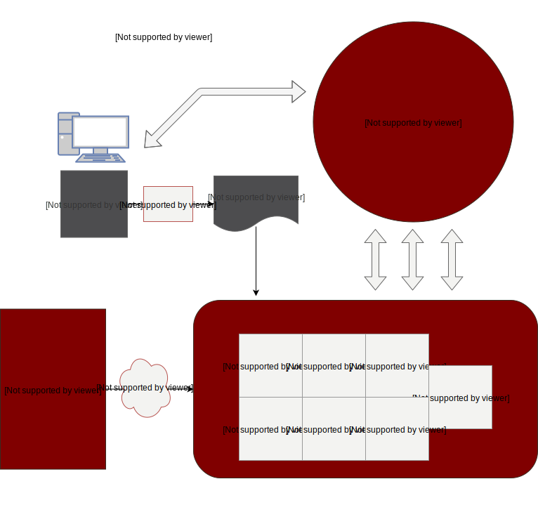

```{r setup, include=FALSE}
options(htmltools.dir.version = FALSE)
knitr::opts_chunk$set(fig.retina = 3, warning = FALSE, message = FALSE)
library(tidyverse)
library(knitr)

# Convert to PDF not working dimensionally
# library(webshot)
# file_name <- paste0("file://", normalizePath("slide-folder/assignment_1.html"))
# webshot(file_name, "assignment_1.pdf")
```

class: text-slide, main-slide, center, middle

# Problem Statement

Hospital costs are rising partially because of high readmission rates within 30 days of patient release. Readmission rates have long been a trusted measure of effective and responsible care and have become a primary assessment driver in the healthcare industry.
---

class: text-slide, main-slide, center, middle

# The Goal

The goal is to research and design a Big data solution that will meet the patient analytics needs of a large health care provider with 500,000 customers (patients) around the world. The big data analytics platform would identify at-risk patients based on past history, chart information, and patient trends. The provider should be able to use this data to identify at-risk patients and provide the necessary care to reduce readmission rates.
---

class: text-slide, table-info

# Data

Data would be refreshed at numerous intervals, including at patient admission, treatment, and exit.

```{r, echo=FALSE}
tibble(`Personal Information` = c("Date of birth", "Contact information", "Next in kin", "Demographics", "Family"),
       `Medical Information` = c("Blood group", "Medical history", "Test reports/Medical images",
                                "Hospital records", "Admission history"),
       `Hospital Records` = c("Date of admission", "Cause of illness", "Duration of stay", "Doctor-in-charge",
                              "Treatments/surgeries"),
       `Financial Information` = c("Insurance provider", "Bill amount", "Insurance claims", "Credit related to medical history", "Employment details")) %>% 
  kable(format = "html")
```

---

class: text-slide

# Analytical Solution

Several models will be deployed that provide probabilistic outcomes for patients around readmission, follow-up, and optimal patient care:

--

* A prediction score for patient readmission prior to admission
--

* A prediction score for readmission as patient receives care at the hospital
--

* A predictive model that determines a patient’s at-risk at the time of exit.
--

* Clustering model that groups patients based on the propensity to re-admit; this model would help understand characteristics better of these two groups and can be used when the other predictive models disagree as a subjective tie-breaker
--

* Once the at-risk patience are identified, a model will be deployed that provide follow-up recommendations to help improve readmission rates
--


Analytics would be performed at numerous points in time, including patient entry, daily/intermittently as medical records are updated, patient exit (throughout the extent of possible readmission classification
---

class: text-slide

# Big Data Technology 

Data Storage format and compression technique
* ORC stores collections of rows in one file and within the collection the row data is stored in a columnar format. This allows parallel processing of row collections across a cluster.  It uses specific encoders for different column data types to improve compression further.

--

Database and Query Execution Engine
* Hive for SQL like queries – as you can simply map HDFS files to Hive tables and query the data. Even the HBase tables can be mapped and Hive can be used to operate on that data.
* Hbase for real-time querying of data. It is used if the application requires random read or random write operations or both.

---

class: text-slide

# Big Data Technology 

Analytics and Data Science Platform
* Apache spark can be used for machine learning and analytics – powerful unified engine, machine language are supported, Apache Spark is one of the most actively developed open source platforms 

--

Cloud vs. On premise decision
* Hosting it on the cloud may cost more if there is consistent long term usage
* It may cost less to actually build your own Hadoop cluster on premise

---

class: text-slide

# Estimating Data Capacity Requirements

* Number of patients: $500,000$
* Average size of electronic medical records including images: $80MB$
* Assuming that the readmission rate: $20\%$
* Growth of data: $20\%$

Total starting size: $500,000 \times80MB=0.04PB$, or about $150TB$

---

class: text-slide
name: cluster-node

# Cluster/Node Capacity

* $H=RCS\times(1+T)\times(1+G)$
* Assuming $T=10%$, $G=20%$, $R=3$, $C=1$, $S=0.04PB$
* $H=3\times1\times0.04\times(1.1)\times(1.2)=0.1584PB= 158.4 TB$
* Assuming each node has a capacity of 24 TB

$n=\frac{H}{d}=\frac{1584}{24}=6.6$; therefore 7 nodes for initial data

* R: Replication factor. Usually 3 in a production cluster.
* C: Compression ratio. When no compression is used, $C=1$.
* S: Initial size of data that needs to be moved to HDFS.
* G: Data growth factor 
* T: Temporary Space; Usually 10-25% of working space
* d: size of each data node

---

class: text-slide
name: cost

# Monthly Cost on Average

* Hardware cost (7x per node cost): $63,000$ 
* Software cost (7x per node cost): $28,000$
* Environment, Power, Cooling, etc: $31,000$
* Full time employees (1x): $110,000$

Total cost: $232,000$<br>
Approximate monthly cost: $20,000$

---

class: last-slide, center

<h1 style="text-align: left;"> Architecture Diagram</h1>


